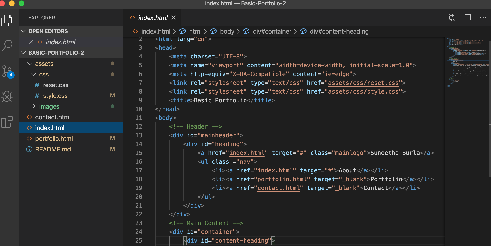
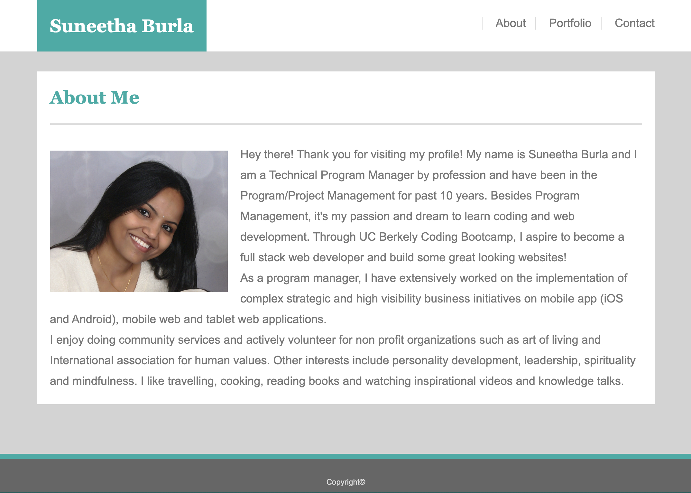
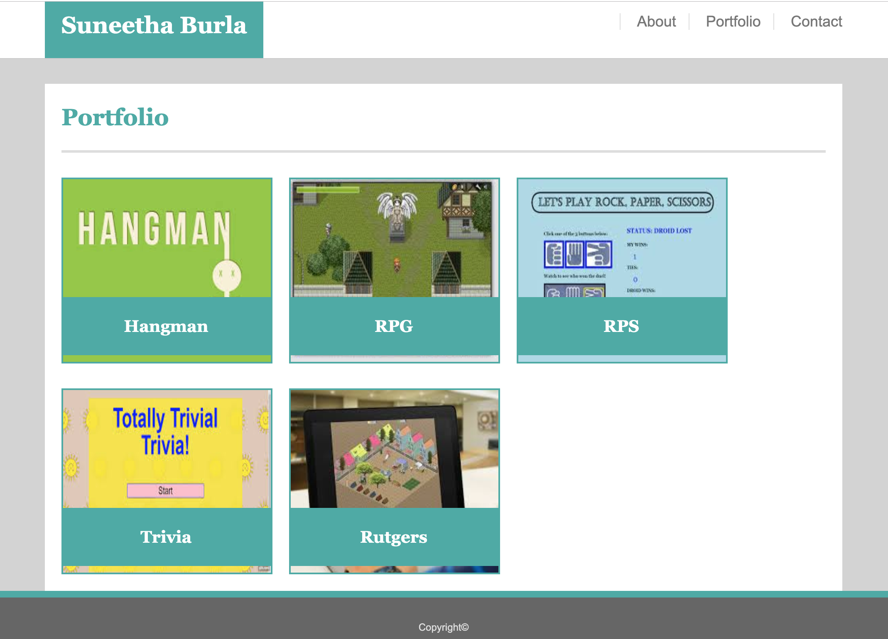

# Basic-Portfolio-2
This is Suneetha Burla's basic portfolio webpage.
## Project Title: Suneetha Burla's Basic Portfolio
## Project Description
This project describes how to build a professional portfolio site using HTML and CSS. The end product of this project is a portfolio site which has links to direct users to basic information page about the developer, a portfolio page which contains the links to different project and repositories and a contact page for the users to fill in and submit their contact information.
## Installation
In order to install this project, follow the instructions below.
* Prerequisites
Laptop (Mac or Windows) with 8 GB RAM and 64-bit dual-core processor
* Install the following programs on your computer
Visual Studio Code
"Open in Browser" Visual Studio Code extension
Git Bash (Windows only)
Terminal (Mac only; preinstalled)
SSH keys
## Accessing the project files on VS Code
* Create a Github account so you can access the project repository, fork it to your account and then clone (make a copy of the repo) onto your local computer
* Using terminal cd into the directory where the repo is cloned and type command "code ." to open the project in VS code to view the project files
* There are three main files index.html, contact.html and portfolio.html and assets folder which contains css folder with style.css and reset.css files and an images folder with all the images used in the project
* The homepage of this project is called index.html which has the code for the landing page for the basic portfolio website, which contains the information about the developer.
Refer to the screenshot Index-html.png for the code snippet from the index.html file

* Index.html-
Refer to the screenshot About-Me.png for the basic portfolio homepage.

* portfolio.html-
Refer to the screenshot Portfolio.png for the portfolio page.

* contact.html-
Refer to the screenshot Contact.png for the contact page.

